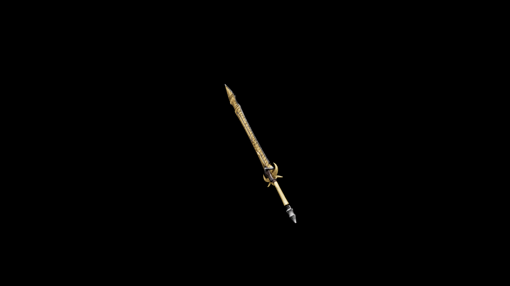

# Bone Great Sword 

Great is the monster that slays many mortal. Greater still is the grafter that shapes the bones of the monster to slay other monsters.

## Item stats

  
Item stats

  <table>
    <tr><th>Weight</th><td>30.6</td></tr>
    <tr><th>Value</th><td>1008</td></tr>
    <tr><th>Damage</th><td>13</td></tr>
    <tr><th>Skill</th><td><a href="../../../../Skills/LongBlade/">Long Blade</a></td></tr>
    <tr><th>Damage Type</th><td>Physical</td></tr>
    <tr><th>Holster Slot</th><td>Back</td></tr>
    <tr><th>Two Handed</th><td>Yes</td></tr>
    <tr><th>Weapon Set</th><td>Bone</td></tr>
  </table>

