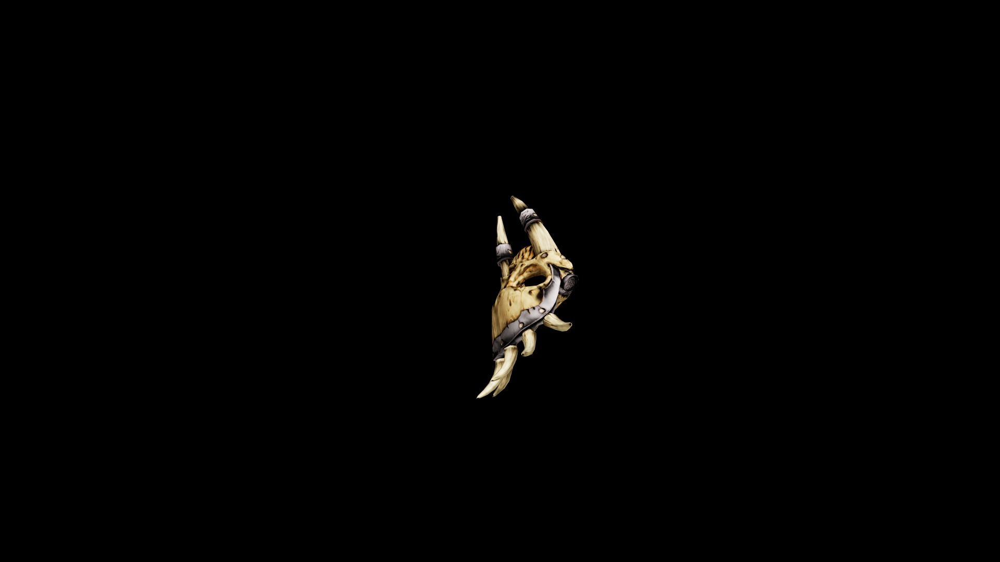

# Bone Knuckles

Grafters can only work fresh bone, and though there are ways to prolong the decay, the humanoid skull paints a grim tale.

## Item stats

  
Item stats

  <table>
    <tr><th>Weight</th><td>2.2</td></tr>
    <tr><th>Value</th><td>38</td></tr>
    <tr><th>Damage</th><td>7</td></tr>
    <tr><th>Skill</th><td><a href="../../../../Skills/HandToHand/">Hand To Hand</a></td></tr>
    <tr><th>Damage Type</th><td>Physical</td></tr>
    <tr><th>Holster Slot</th><td>Hip</td></tr>
    <tr><th>Two Handed</th><td>No</td></tr>
    <tr><th>Weapon Set</th><td>Bone</td></tr>
  </table>

