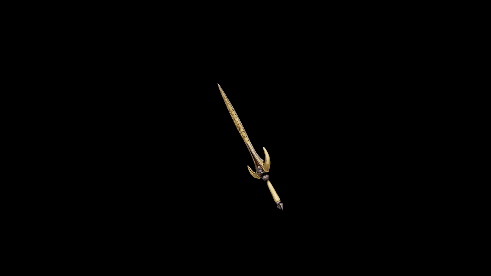

# Bone Long Sword

The legacy of a warrior begins with the forging of their weapon. The legacy of the grafter, begins and ends here.

## Item stats

  
Item stats

  <table>
    <tr><th>Weight</th><td>25.5</td></tr>
    <tr><th>Value</th><td>663</td></tr>
    <tr><th>Damage</th><td>12</td></tr>
    <tr><th>Skill</th><td><a href="../../../../Skills/LongBlade/">Long Blade</a></td></tr>
    <tr><th>Damage Type</th><td>Physical</td></tr>
    <tr><th>Holster Slot</th><td>Hip</td></tr>
    <tr><th>Two Handed</th><td>No</td></tr>
    <tr><th>Weapon Set</th><td>Bone</td></tr>
  </table>

