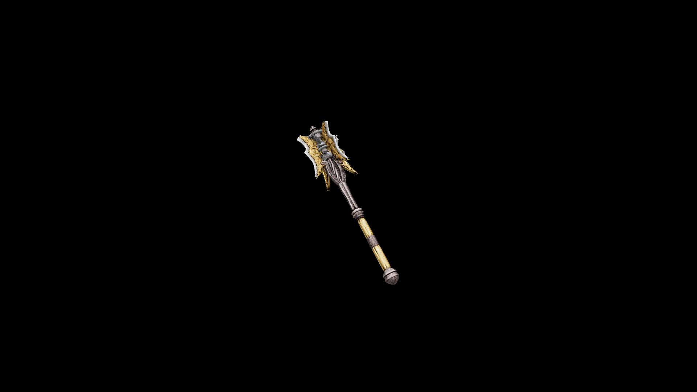

# Bone Mace One Handed 

It is often a mark of poor grafting that leaves so much metal exposed. Though, like all else, there are exceptions to this rule.

## Item stats

  
Item stats

  <table>
    <tr><th>Weight</th><td>20.4</td></tr>
    <tr><th>Value</th><td>516</td></tr>
    <tr><th>Damage</th><td>9</td></tr>
    <tr><th>Skill</th><td><a href="../../../../Skills/Blunt/">Blunt</a></td></tr>
    <tr><th>Damage Type</th><td>Physical</td></tr>
    <tr><th>Holster Slot</th><td>Hip</td></tr>
    <tr><th>Two Handed</th><td>No</td></tr>
    <tr><th>Weapon Set</th><td>Bone</td></tr>
  </table>

