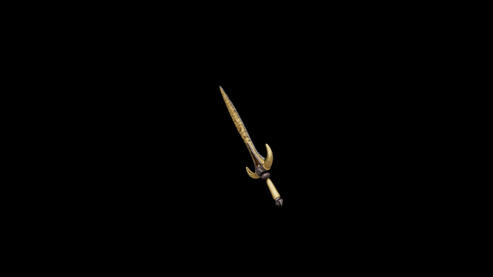

# Bone Short Sword

This blade is often the entry point for apprentice grafters: the design is small enough to not waste material, yet intricate enough for theory and book learning to be applied.

## Item stats

  
Item stats

  <table>
    <tr><th>Weight</th><td>9.6</td></tr>
    <tr><th>Value</th><td>172</td></tr>
    <tr><th>Damage</th><td>7</td></tr>
    <tr><th>Skill</th><td><a href="../../../../Skills/ShortBlade/">Short Blade</a></td></tr>
    <tr><th>Damage Type</th><td>Physical</td></tr>
    <tr><th>Holster Slot</th><td>Hip</td></tr>
    <tr><th>Two Handed</th><td>No</td></tr>
    <tr><th>Weapon Set</th><td>Bone</td></tr>
  </table>

