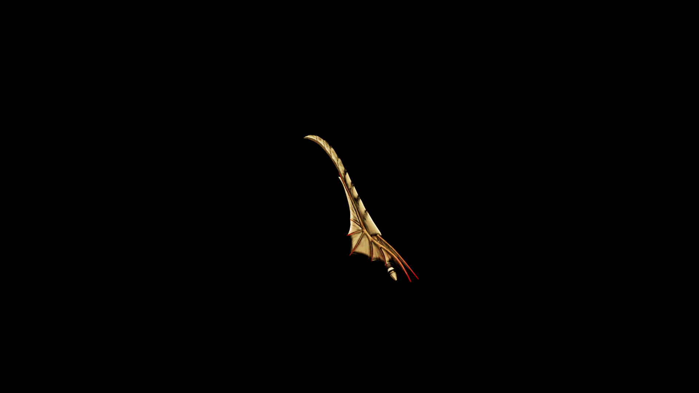

# Chitin Long Sword

The main leg segments of the razorgill make for an effective, serrated edge.

## Item stats

  
Item stats

  <table>
    <tr><th>Weight</th><td>20</td></tr>
    <tr><th>Value</th><td>104</td></tr>
    <tr><th>Damage</th><td>12</td></tr>
    <tr><th>Skill</th><td><a href="../../../../Skills/LongBlade/">Long Blade</a></td></tr>
    <tr><th>Damage Type</th><td>Physical</td></tr>
    <tr><th>Holster Slot</th><td>Hip</td></tr>
    <tr><th>Two Handed</th><td>No</td></tr>
    <tr><th>Weapon Set</th><td>Chitin</td></tr>
  </table>

