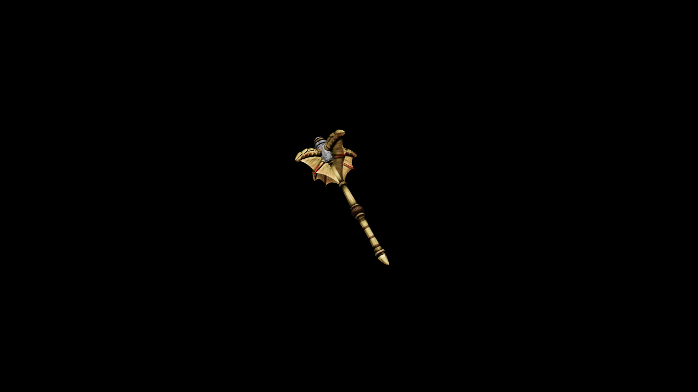

# Chitin Mace

Some of the smaller leftovers from making other weapons has allowed for an effective mace.

## Item stats

  
Item stats

  <table>
    <tr><th>Weight</th><td>16</td></tr>
    <tr><th>Value</th><td>81</td></tr>
    <tr><th>Damage</th><td>9</td></tr>
    <tr><th>Skill</th><td><a href="../../../../Skills/Blunt/">Blunt</a></td></tr>
    <tr><th>Damage Type</th><td>Physical</td></tr>
    <tr><th>Holster Slot</th><td>Hip</td></tr>
    <tr><th>Two Handed</th><td>No</td></tr>
    <tr><th>Weapon Set</th><td>Chitin</td></tr>
  </table>

