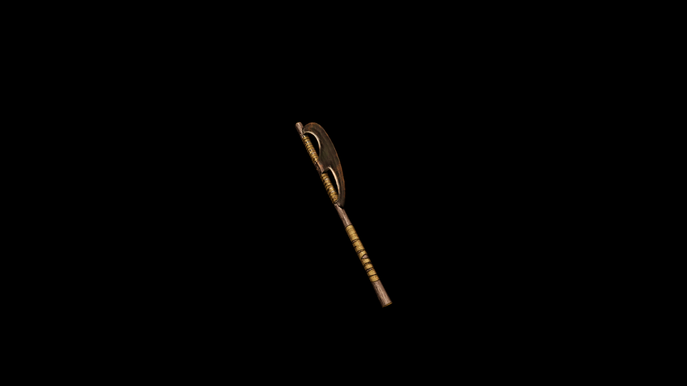

# DiKadian Battle Axe

The blade vibrates with each swing, stoking the warrior’s battle rage and rallying allies to the fray.

## Item stats

  
Item stats

  <table>
    <tr><th>Weight</th><td>52.9</td></tr>
    <tr><th>Value</th><td>2212</td></tr>
    <tr><th>Damage</th><td>12</td></tr>
    <tr><th>Skill</th><td><a href="../../../../Skills/Axe/">Axe</a></td></tr>
    <tr><th>Damage Type</th><td>Silver</td></tr>
    <tr><th>Holster Slot</th><td>Back</td></tr>
    <tr><th>Two Handed</th><td>Yes</td></tr>
    <tr><th>Weapon Set</th><td>DiKadian</td></tr>
  </table>

