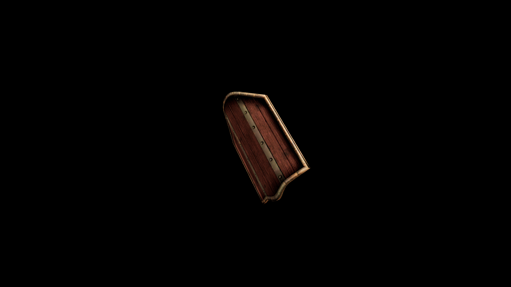

# DiKadian Shield

It stands as both protection and symbol of their unbreakable will.

## Item stats

  
Item stats

  <table>
    <tr><th>Weight</th><td>27.4</td></tr>
    <tr><th>Value</th><td>680</td></tr>
    <tr><th>Damage</th><td>4</td></tr>
    <tr><th>Skill</th><td><a href="../../../../Skills/Block/">Block</a></td></tr>
    <tr><th>Damage Type</th><td>Silver</td></tr>
    <tr><th>Holster Slot</th><td>Hip</td></tr>
    <tr><th>Two Handed</th><td>No</td></tr>
    <tr><th>Weapon Set</th><td>DiKadian</td></tr>
    <tr><th>Shield Type</th><td><a href="../../../../Gameplay/ShieldTypes/#standard-shields">Standard</a></td></tr>
  </table>

