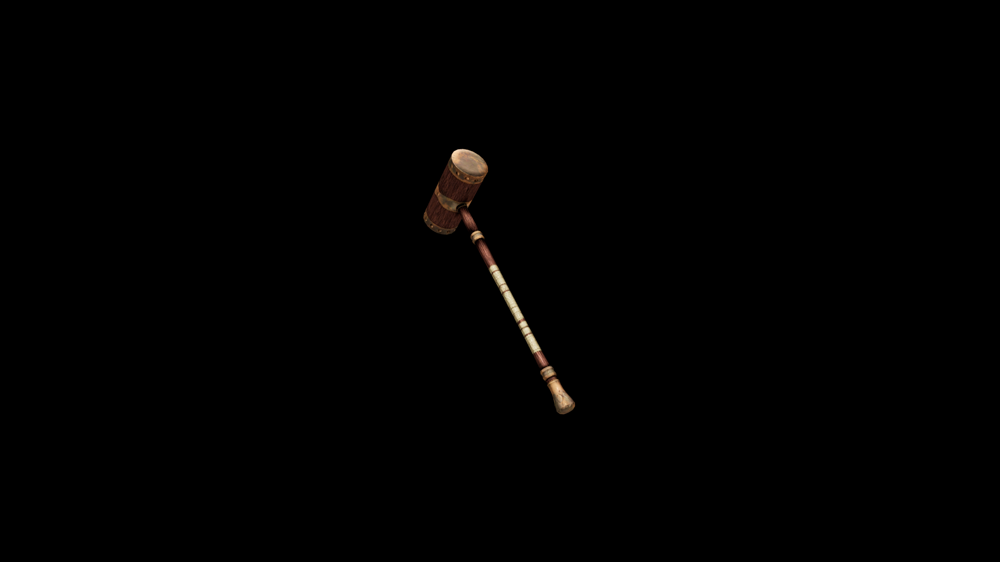

# DiKadian War Hammer

Balanced for powerful overhead swings and punishing forward drives, it’s wielded by frontline crusaders and temple guards who fight not just to win—but to illuminate the battlefield with righteous fury

 

## Item stats

  
Item stats

  <table>
    <tr><th>Weight</th><td>54.8</td></tr>
    <tr><th>Value</th><td>2212</td></tr>
    <tr><th>Damage</th><td>14</td></tr>
    <tr><th>Skill</th><td><a href="../../../../Skills/Blunt/">Blunt</a></td></tr>
    <tr><th>Damage Type</th><td>Silver</td></tr>
    <tr><th>Holster Slot</th><td>Back</td></tr>
    <tr><th>Two Handed</th><td>Yes</td></tr>
    <tr><th>Weapon Set</th><td>DiKadian</td></tr>
  </table>

