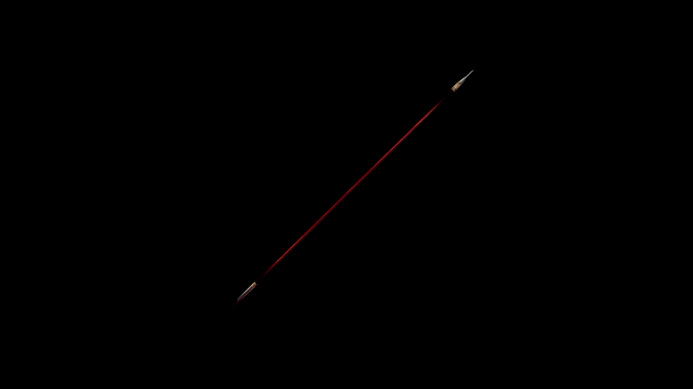

# Dwarven Arrow

The fletching is minimal but precise, crafted from dark-feathered cliff raptors bred in the high crags

## Item stats

  
Item stats

  <table>
    <tr><th>Weight</th><td>0.2</td></tr>
    <tr><th>Value</th><td>19</td></tr>
    <tr><th>Damage</th><td>7</td></tr>
    <tr><th>Skill</th><td><a href="../../../../Skills/Marksman/">Marksman</a></td></tr>
    <tr><th>Damage Type</th><td>Silver</td></tr>
    <tr><th>Holster Slot</th><td>Hip</td></tr>
    <tr><th>Two Handed</th><td>No</td></tr>
    <tr><th>Weapon Set</th><td>Dwarven</td></tr>
  </table>

