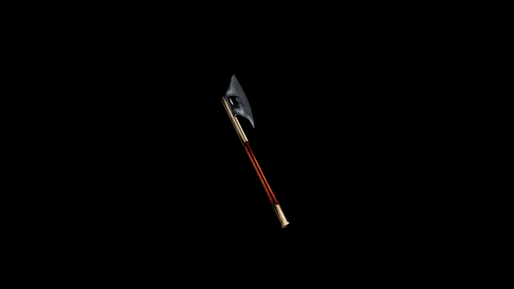

# Dwarven Battle Axe

The heavy, broad axe head is forged from enchanted iron, with a thick cutting edge that can easily cut through armor and shields alike

## Item stats
| Weight  | Value | Armor  |
|---------|-------|--------|
| 56.6    | 2488.0| 12.0   |