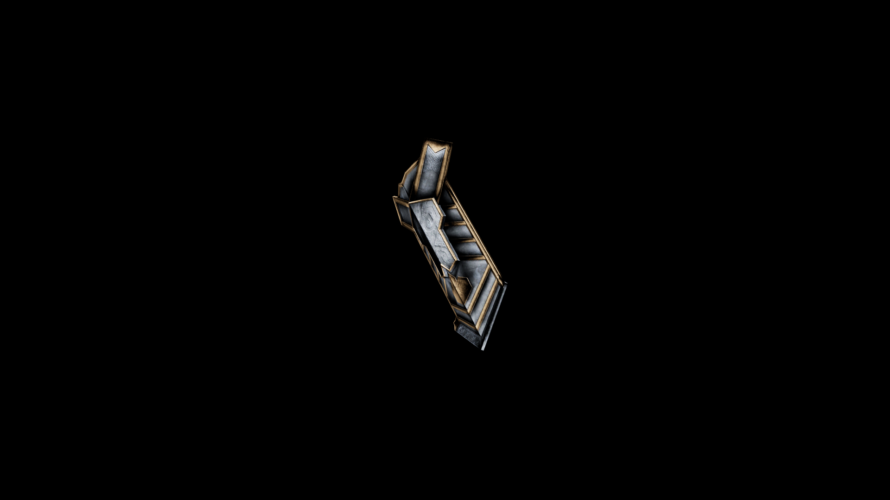

# Dwarven Great Shield

Though it lacks the elegance of elven design, it more than makes up for it with durability and raw, vicious functionality

## Item stats

  
Item stats

  <table>
    <tr><th>Weight</th><td>54.5</td></tr>
    <tr><th>Value</th><td>1225</td></tr>
    <tr><th>Damage</th><td>5.5</td></tr>
    <tr><th>Skill</th><td><a href="../../../../Skills/Block/">Block</a></td></tr>
    <tr><th>Damage Type</th><td>Silver</td></tr>
    <tr><th>Holster Slot</th><td>Hip</td></tr>
    <tr><th>Two Handed</th><td>No</td></tr>
    <tr><th>Weapon Set</th><td>Dwarven</td></tr>
    <tr><th>Shield Type</th><td><a href="../../../../Gameplay/ShieldTypes/#great-shields">Great</a></td></tr>
  </table>

