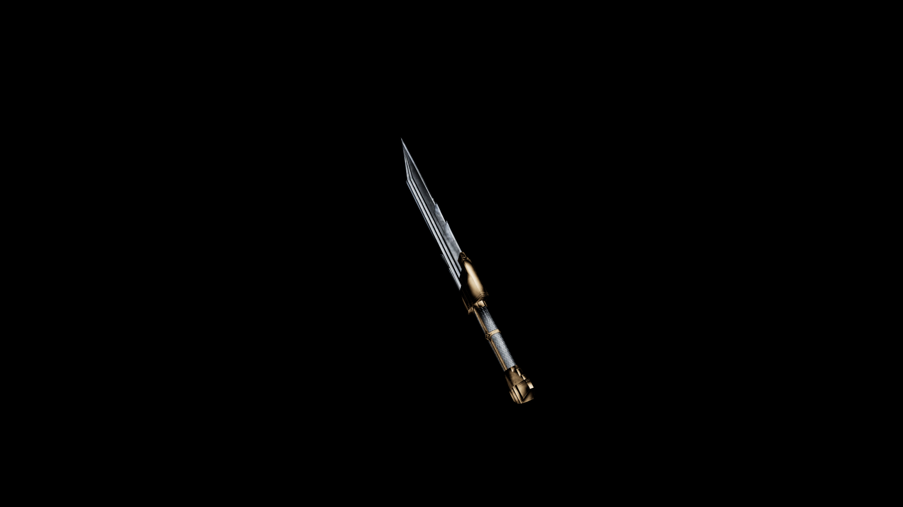

# Dwarven Short Sword

Designed more for effectiveness than elegance, this sword is a favorite among dwarven tunnel sentries, shield‑brothers, and vanguard skirmishers.

## Item stats

  
Item stats

  <table>
    <tr><th>Weight</th><td>15.7</td></tr>
    <tr><th>Value</th><td>516</td></tr>
    <tr><th>Damage</th><td>6</td></tr>
    <tr><th>Skill</th><td><a href="../../../../Skills/ShortBlade/">Short Blade</a></td></tr>
    <tr><th>Damage Type</th><td>Silver</td></tr>
    <tr><th>Holster Slot</th><td>Hip</td></tr>
    <tr><th>Two Handed</th><td>No</td></tr>
    <tr><th>Weapon Set</th><td>Dwarven</td></tr>
  </table>

