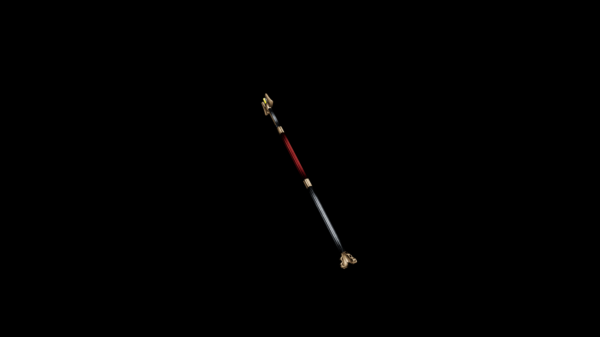

# Dwarven Staff

Balanced perfectly for its wielder, allowing seamless transitions between defensive wards and crushing blows when enemies draw too near

## Item stats

  
Item stats

  <table>
    <tr><th>Weight</th><td>16.8</td></tr>
    <tr><th>Value</th><td>1340</td></tr>
    <tr><th>Damage</th><td>3</td></tr>
    <tr><th>Skill</th><td><a href="../../../../Skills/Staff/">Staff</a></td></tr>
    <tr><th>Damage Type</th><td>Silver</td></tr>
    <tr><th>Holster Slot</th><td>Back</td></tr>
    <tr><th>Two Handed</th><td>Yes</td></tr>
    <tr><th>Weapon Set</th><td>Dwarven</td></tr>
  </table>

