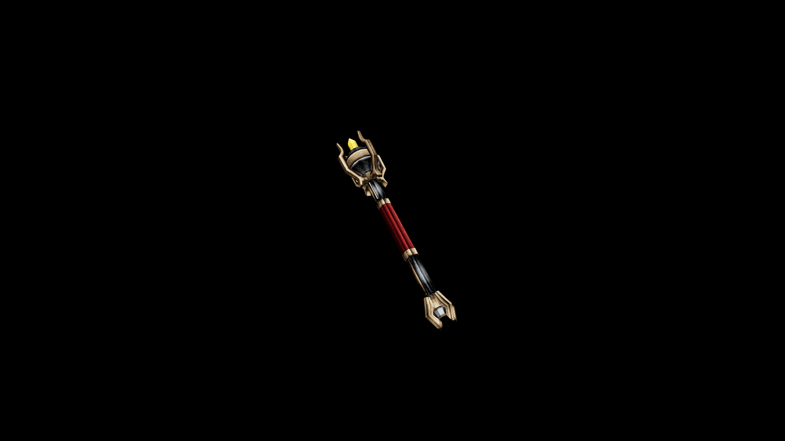

# Dwarven Wand

Though small in stature, it channels powerful, earthbound spells—shattering stone, summoning flame, and reinforcing allies with the resilience of the mountains.

## Item stats

  
Item stats

  <table>
    <tr><th>Weight</th><td>2.6</td></tr>
    <tr><th>Value</th><td>765</td></tr>
    <tr><th>Damage</th><td>4</td></tr>
    <tr><th>Skill</th><td><a href="../../../../Skills/Wand/">Wand</a></td></tr>
    <tr><th>Damage Type</th><td>Silver</td></tr>
    <tr><th>Holster Slot</th><td>Hip</td></tr>
    <tr><th>Two Handed</th><td>No</td></tr>
    <tr><th>Weapon Set</th><td>Dwarven</td></tr>
  </table>

