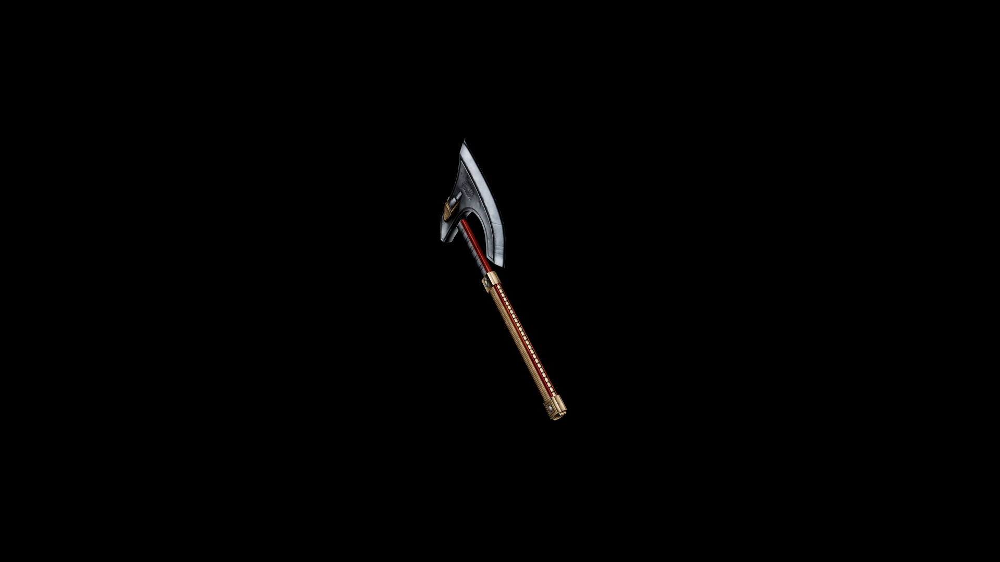

# Dwarven War Axe

The axe head is heavy and broad, capable of splitting both shields and steel with a single, deliberate blow

## Item stats

  
Item stats

  <table>
    <tr><th>Weight</th><td>27.2</td></tr>
    <tr><th>Value</th><td>1167</td></tr>
    <tr><th>Damage</th><td>500</td></tr>
    <tr><th>Skill</th><td><a href="../../../../Skills/Axe/">Axe</a></td></tr>
    <tr><th>Damage Type</th><td>Silver</td></tr>
    <tr><th>Holster Slot</th><td>Hip</td></tr>
    <tr><th>Two Handed</th><td>No</td></tr>
    <tr><th>Weapon Set</th><td>Bone</td></tr>
  </table>

