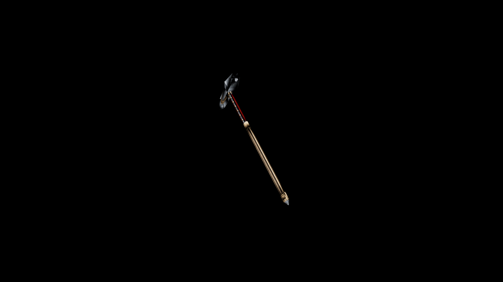

# Dwarven War Hammer

Dwarves prize this weapon not only for its sheer destructive power, but for the craftsmanship that allows it to channel their immense strength with precision and control

## Item stats

  
Item stats

  <table>
    <tr><th>Weight</th><td>58.7</td></tr>
    <tr><th>Value</th><td>2488</td></tr>
    <tr><th>Damage</th><td>14</td></tr>
    <tr><th>Skill</th><td><a href="../../../../Skills/Blunt/">Blunt</a></td></tr>
    <tr><th>Damage Type</th><td>Silver</td></tr>
    <tr><th>Holster Slot</th><td>Back</td></tr>
    <tr><th>Two Handed</th><td>Yes</td></tr>
    <tr><th>Weapon Set</th><td>Dwarven</td></tr>
  </table>

