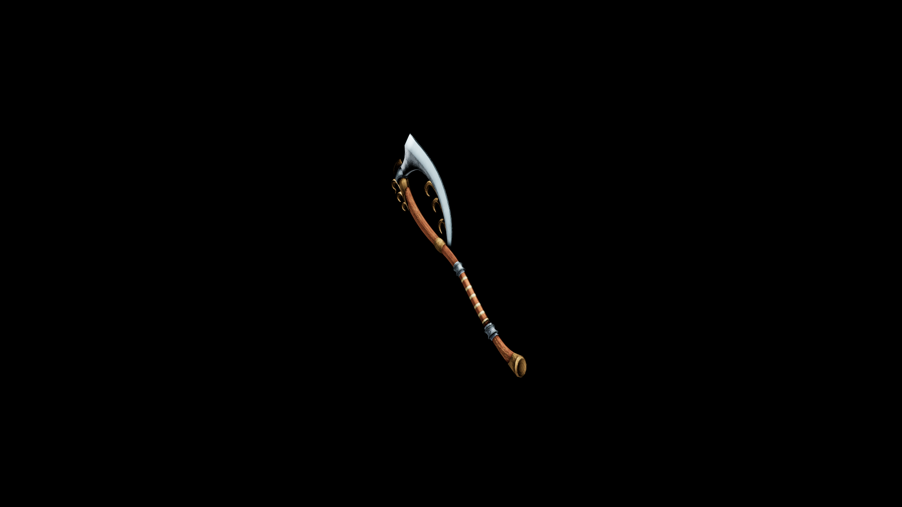

# Elven Battle Axe

Each edge is razor-sharp, designed for fluid, sweeping strikes that combine elegance with lethal force

## Item stats

  
Item stats

  <table>
    <tr><th>Weight</th><td>60.3</td></tr>
    <tr><th>Value</th><td>2765</td></tr>
    <tr><th>Damage</th><td>13</td></tr>
    <tr><th>Skill</th><td><a href="../../../../Skills/Axe/">Axe</a></td></tr>
    <tr><th>Damage Type</th><td>Silver</td></tr>
    <tr><th>Holster Slot</th><td>Back</td></tr>
    <tr><th>Two Handed</th><td>Yes</td></tr>
    <tr><th>Weapon Set</th><td>Elven</td></tr>
  </table>

