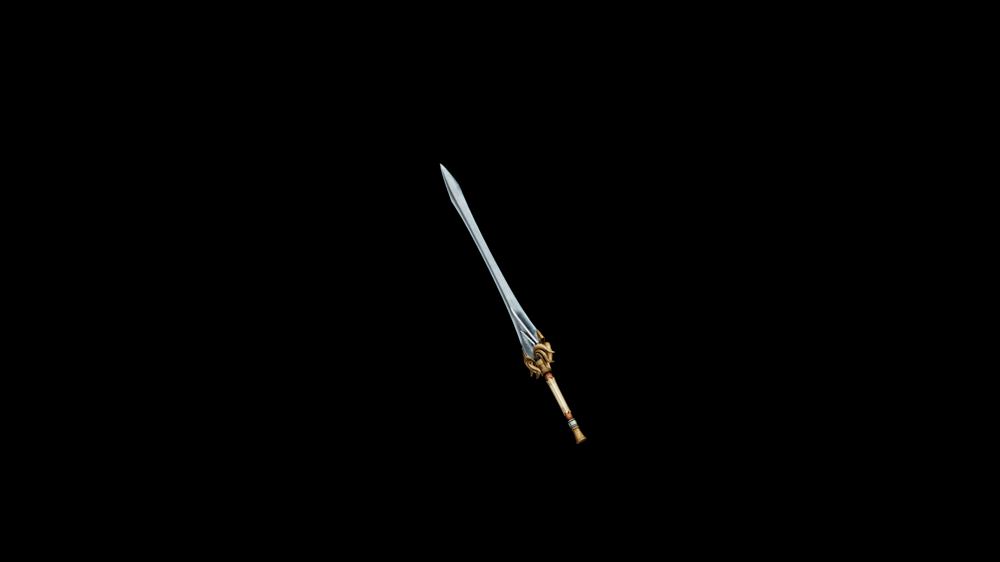

# Elven Great Sword

When the moon rises, the blade sings its song—swift as the night breeze, sharp as a falling star

## Item stats

  
Item stats

  <table>
    <tr><th>Weight</th><td>53.6</td></tr>
    <tr><th>Value</th><td>3360</td></tr>
    <tr><th>Damage</th><td>14</td></tr>
    <tr><th>Skill</th><td><a href="../../../../Skills/LongBlade/">Long Blade</a></td></tr>
    <tr><th>Damage Type</th><td>Silver</td></tr>
    <tr><th>Holster Slot</th><td>Back</td></tr>
    <tr><th>Two Handed</th><td>Yes</td></tr>
    <tr><th>Weapon Set</th><td>Elven</td></tr>
  </table>

