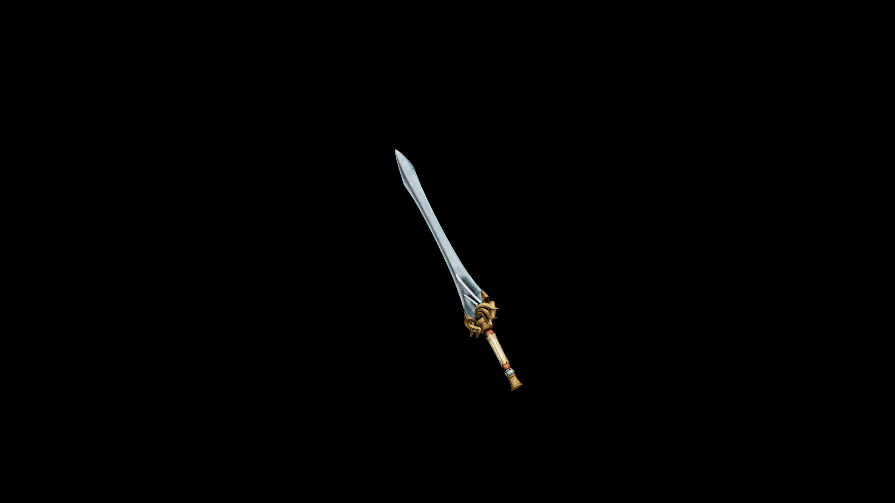

# Elven Long Sword

Not only a weapon but a symbol of heritage, attunement, and unbroken harmony with nature and magic.

## Item stats

  
Item stats

  <table>
    <tr><th>Weight</th><td>44.6</td></tr>
    <tr><th>Value</th><td>2212</td></tr>
    <tr><th>Damage</th><td>11</td></tr>
    <tr><th>Skill</th><td><a href="../../../../Skills/LongBlade/">Long Blade</a></td></tr>
    <tr><th>Damage Type</th><td>Silver</td></tr>
    <tr><th>Holster Slot</th><td>Hip</td></tr>
    <tr><th>Two Handed</th><td>No</td></tr>
    <tr><th>Weapon Set</th><td>Elven</td></tr>
  </table>

