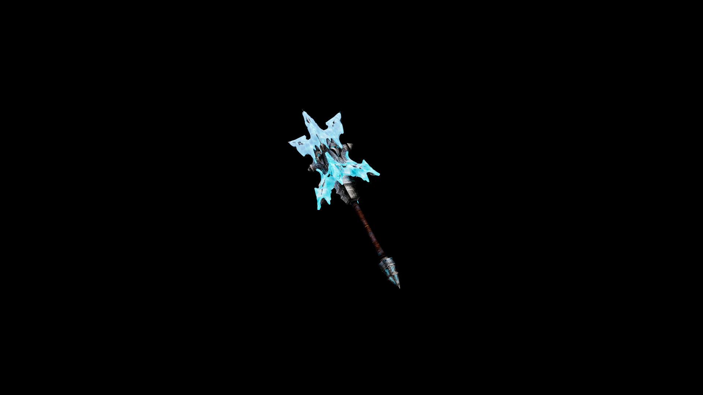

# Frostbound Club

Lightweight for its size, the Frostbound Club can be swung rapidly in succession, turning every blow into a chilling assault that saps strength as well as health.

## Item stats

  
Item stats

  <table>
    <tr><th>Weight</th><td>25.1</td></tr>
    <tr><th>Value</th><td>1097</td></tr>
    <tr><th>Damage</th><td>7</td></tr>
    <tr><th>Skill</th><td><a href="../../../../Skills/Blunt/">Blunt</a></td></tr>
    <tr><th>Damage Type</th><td>Silver</td></tr>
    <tr><th>Holster Slot</th><td>Hip</td></tr>
    <tr><th>Two Handed</th><td>No</td></tr>
    <tr><th>Weapon Set</th><td>FrostBound</td></tr>
  </table>

