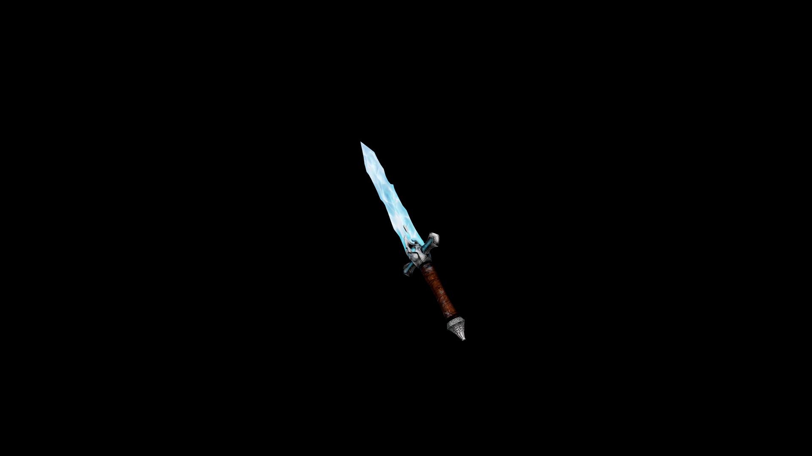

# Frostbound Dagger

Its edge holds a razor‑sharp frostbite, capable of leaving wounds that burn with cold and slow the victim’s blood.

## Item stats

  
Item stats

  <table>
    <tr><th>Weight</th><td>8.8</td></tr>
    <tr><th>Value</th><td>357</td></tr>
    <tr><th>Damage</th><td>500</td></tr>
    <tr><th>Skill</th><td><a href="../../../../Skills/ShortBlade/">Short Blade</a></td></tr>
    <tr><th>Damage Type</th><td>Silver</td></tr>
    <tr><th>Holster Slot</th><td>Hip</td></tr>
    <tr><th>Two Handed</th><td>No</td></tr>
    <tr><th>Weapon Set</th><td>Bone</td></tr>
  </table>

