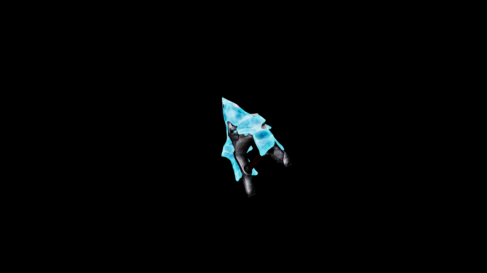

# Frostbound Knuckles

They are an extension of the ice itself, turning the user’s hands into devastating tools of winter.

## Item stats

  
Item stats

  <table>
    <tr><th>Weight</th><td>4.4</td></tr>
    <tr><th>Value</th><td>153</td></tr>
    <tr><th>Damage</th><td>6</td></tr>
    <tr><th>Skill</th><td><a href="../../../../Skills/HandToHand/">Hand To Hand</a></td></tr>
    <tr><th>Damage Type</th><td>Silver</td></tr>
    <tr><th>Holster Slot</th><td>Hip</td></tr>
    <tr><th>Two Handed</th><td>No</td></tr>
    <tr><th>Weapon Set</th><td>FrostBound</td></tr>
  </table>

