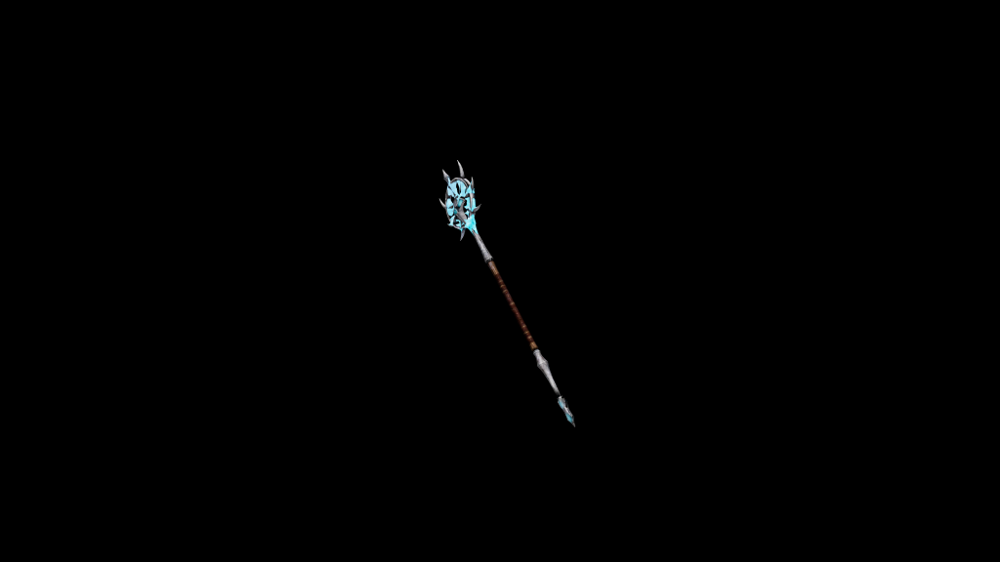

# Frostbound Staff

When raised in battle or ritual, it summons storms of ice, stills flame, and cloaks allies in protective veils of cold.

## Item stats

  
Item stats

  <table>
    <tr><th>Weight</th><td>20</td></tr>
    <tr><th>Value</th><td>1786</td></tr>
    <tr><th>Damage</th><td>4</td></tr>
    <tr><th>Skill</th><td><a href="../../../../Skills/Staff/">Staff</a></td></tr>
    <tr><th>Damage Type</th><td>Silver</td></tr>
    <tr><th>Holster Slot</th><td>Back</td></tr>
    <tr><th>Two Handed</th><td>No</td></tr>
    <tr><th>Weapon Set</th><td>FrostBound</td></tr>
  </table>

