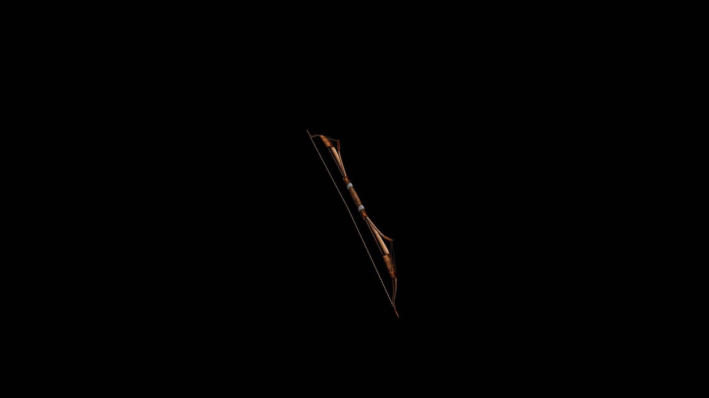

# Iron Bow

The second set of smaller arms makes up for the power drawbacks that come with ease of manufaturing.

## Item stats

  
Item stats

  <table>
    <tr><th>Weight</th><td>9.1</td></tr>
    <tr><th>Value</th><td>182</td></tr>
    <tr><th>Damage</th><td>9</td></tr>
    <tr><th>Skill</th><td><a href="../../../../Skills/Marksman/">Marksman</a></td></tr>
    <tr><th>Damage Type</th><td>Physical</td></tr>
    <tr><th>Holster Slot</th><td>Back</td></tr>
    <tr><th>Two Handed</th><td>No</td></tr>
    <tr><th>Weapon Set</th><td>Iron</td></tr>
  </table>

