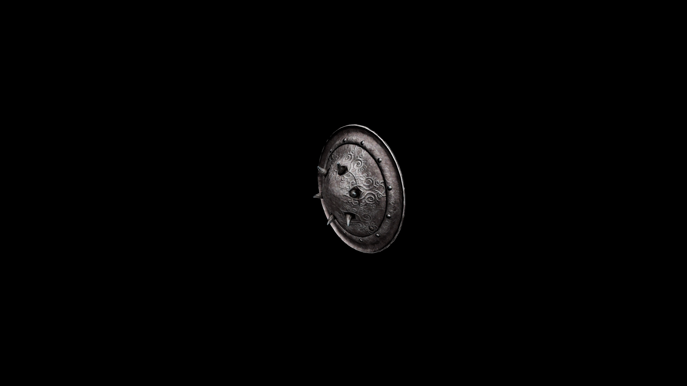

# Iron Buckler Shield

A favored implement of light infantry and settlement guards. Its small size offsets the weight of its solid iron make.

## Item stats
| Weight  | Value | Damage |
|---------|-------|--------|
| 5.7     | 106.0 | 2.5    |