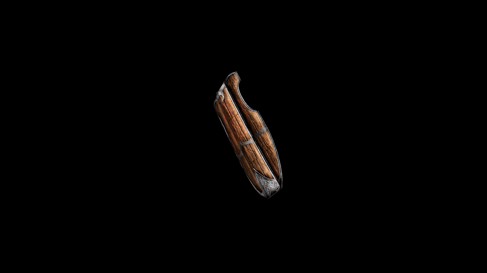

# Iron Great Shield

A large, heavy thing that would be just as content as the door to a small fort as a personal shield.

## Item stats

  
Item stats

  <table>
    <tr><th>Weight</th><td>29.6</td></tr>
    <tr><th>Value</th><td>272</td></tr>
    <tr><th>Damage</th><td>5.5</td></tr>
    <tr><th>Skill</th><td><a href="../../../../Skills/Block/">Block</a></td></tr>
    <tr><th>Damage Type</th><td>Physical</td></tr>
    <tr><th>Holster Slot</th><td>Hip</td></tr>
    <tr><th>Two Handed</th><td>No</td></tr>
    <tr><th>Weapon Set</th><td>Iron</td></tr>
    <tr><th>Shield Type</th><td><a href="../../../../Gameplay/ShieldTypes/#great-shields">Great</a></td></tr>
  </table>

