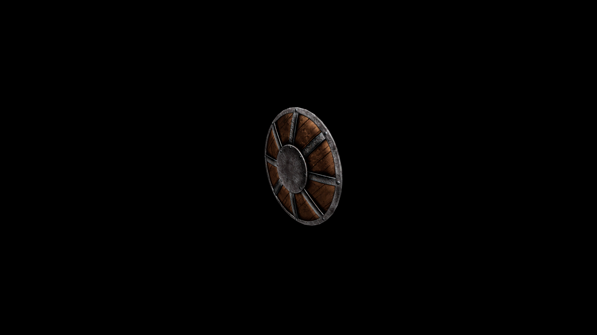

# Iron Shield

Some have said that this style of shield is rough and unwieldy. They have also said they would rather have it than a straw mattress.

## Item stats

  
Item stats

  <table>
    <tr><th>Weight</th><td>15.9</td></tr>
    <tr><th>Value</th><td>170</td></tr>
    <tr><th>Damage</th><td>3</td></tr>
    <tr><th>Skill</th><td><a href="../../../../Skills/Block/">Block</a></td></tr>
    <tr><th>Damage Type</th><td>Physical</td></tr>
    <tr><th>Holster Slot</th><td>Hip</td></tr>
    <tr><th>Two Handed</th><td>No</td></tr>
    <tr><th>Weapon Set</th><td>Iron</td></tr>
    <tr><th>Shield Type</th><td><a href="../../../../Gameplay/ShieldTypes/#standard-shields">Standard</a></td></tr>
  </table>

