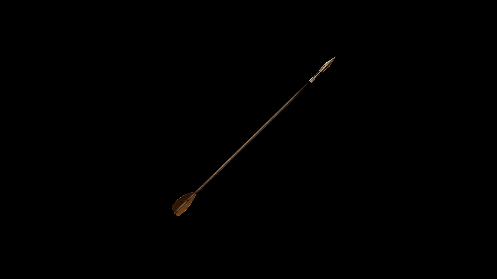

# Kadian Arrow

Its sleek, wooden shaft is dark and smooth, adorned with intricate etchings that mark its noble origins. The arrowhead is uniquely shaped, a sharp, tri-pronged metal point that ensures swift penetration into targets

## Item stats

  
Item stats

  <table>
    <tr><th>Weight</th><td>0.2</td></tr>
    <tr><th>Value</th><td>23</td></tr>
    <tr><th>Damage</th><td>9</td></tr>
    <tr><th>Skill</th><td><a href="../../../../Skills/Marksman/">Marksman</a></td></tr>
    <tr><th>Damage Type</th><td>Silver</td></tr>
    <tr><th>Holster Slot</th><td>Hip</td></tr>
    <tr><th>Two Handed</th><td>No</td></tr>
    <tr><th>Weapon Set</th><td>Kadian</td></tr>
  </table>

