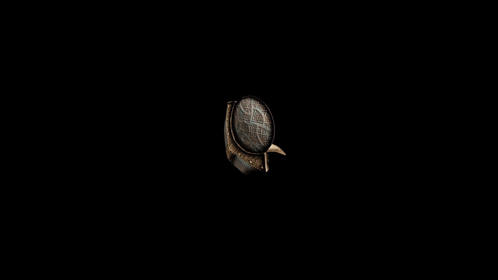

# Kadian Buckler Shield

Its round, metal body is adorned with intricate etchings that represent the Kadian kingdom's heritage and symbols of valor.

## Item stats

  
Item stats

  <table>
    <tr><th>Weight</th><td>11.8</td></tr>
    <tr><th>Value</th><td>584</td></tr>
    <tr><th>Damage</th><td>3</td></tr>
    <tr><th>Skill</th><td><a href="../../../../Skills/Block/">Block</a></td></tr>
    <tr><th>Damage Type</th><td>Silver</td></tr>
    <tr><th>Holster Slot</th><td>Hip</td></tr>
    <tr><th>Two Handed</th><td>No</td></tr>
    <tr><th>Weapon Set</th><td>Kadian</td></tr>
    <tr><th>Shield Type</th><td><a href="../../../../Gameplay/ShieldTypes/#buckler-shields">Buckler</a></td></tr>
  </table>

