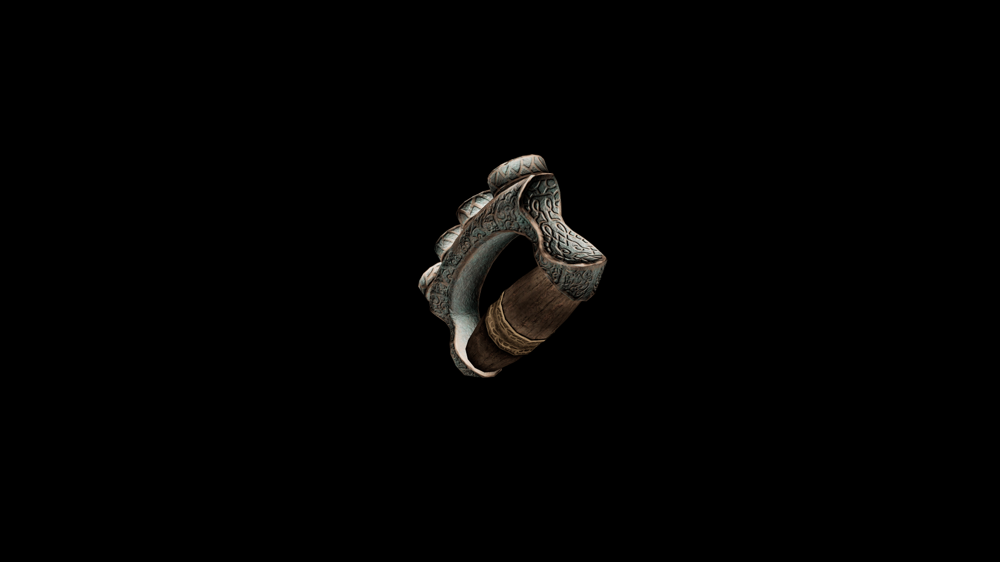

# Kadian Knuckles

Their reinforced structure and sharp ridges make them a deadly tool for delivering powerful punches that can crush armor and bone alike.

## Item stats

  
Item stats

  <table>
    <tr><th>Weight</th><td>4.1</td></tr>
    <tr><th>Value</th><td>140</td></tr>
    <tr><th>Damage</th><td>7</td></tr>
    <tr><th>Skill</th><td><a href="../../../../Skills/HandToHand/">Hand To Hand</a></td></tr>
    <tr><th>Damage Type</th><td>Silver</td></tr>
    <tr><th>Holster Slot</th><td>Hip</td></tr>
    <tr><th>Two Handed</th><td>No</td></tr>
    <tr><th>Weapon Set</th><td>Kadian</td></tr>
  </table>

