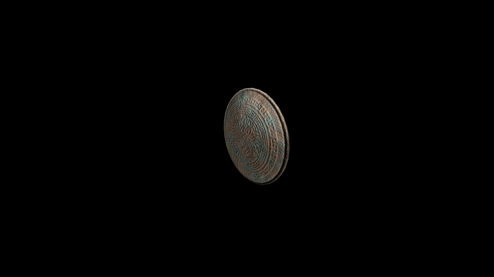

# Kadian Shield

The intricate patterns etched into the shield's surface, particularly the fierce face of a lion or mythical creature, signify the power and majesty of the Kadian culture.

## Item stats

  
Item stats

  <table>
    <tr><th>Weight</th><td>33.2</td></tr>
    <tr><th>Value</th><td>935</td></tr>
    <tr><th>Damage</th><td>3.5</td></tr>
    <tr><th>Skill</th><td><a href="../../../../Skills/Block/">Block</a></td></tr>
    <tr><th>Damage Type</th><td>Silver</td></tr>
    <tr><th>Holster Slot</th><td>Back</td></tr>
    <tr><th>Two Handed</th><td>No</td></tr>
    <tr><th>Weapon Set</th><td>Kadian</td></tr>
    <tr><th>Shield Type</th><td><a href="../../../../Gameplay/ShieldTypes/#standard-shields">Standard</a></td></tr>
  </table>

