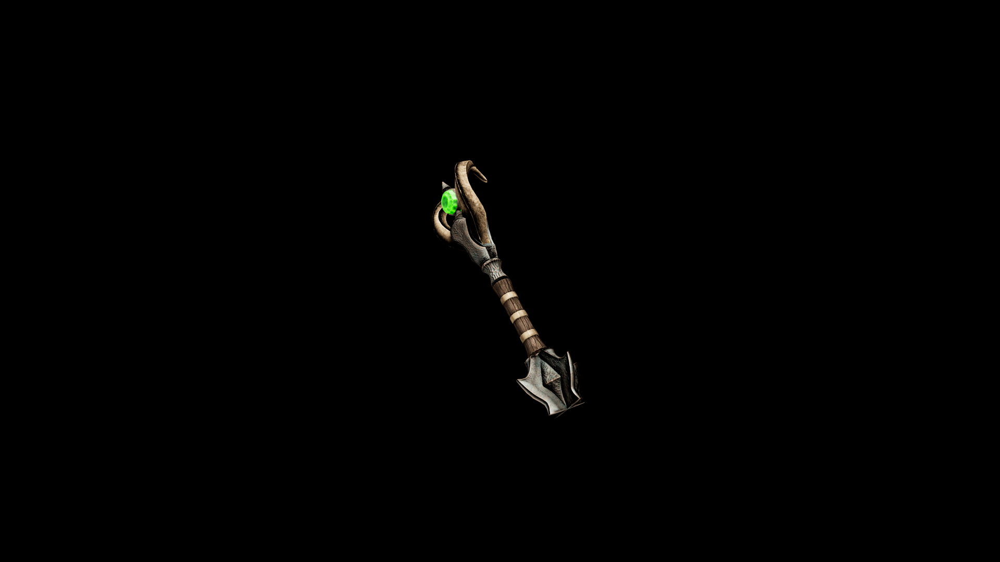

# Kadian Wand

With its slender shaft and delicate yet potent design, the Kadian Wand allows for the casting of intricate spells with finesse and clarity, making it an essential weapon for any mage focused on subtle magic.

## Item stats

  
Item stats

  <table>
    <tr><th>Weight</th><td>3</td></tr>
    <tr><th>Value</th><td>935</td></tr>
    <tr><th>Damage</th><td>4</td></tr>
    <tr><th>Skill</th><td><a href="../../../../Skills/Wand/">Wand</a></td></tr>
    <tr><th>Damage Type</th><td>Silver</td></tr>
    <tr><th>Holster Slot</th><td>Hip</td></tr>
    <tr><th>Two Handed</th><td>No</td></tr>
    <tr><th>Weapon Set</th><td>Kadian</td></tr>
  </table>

