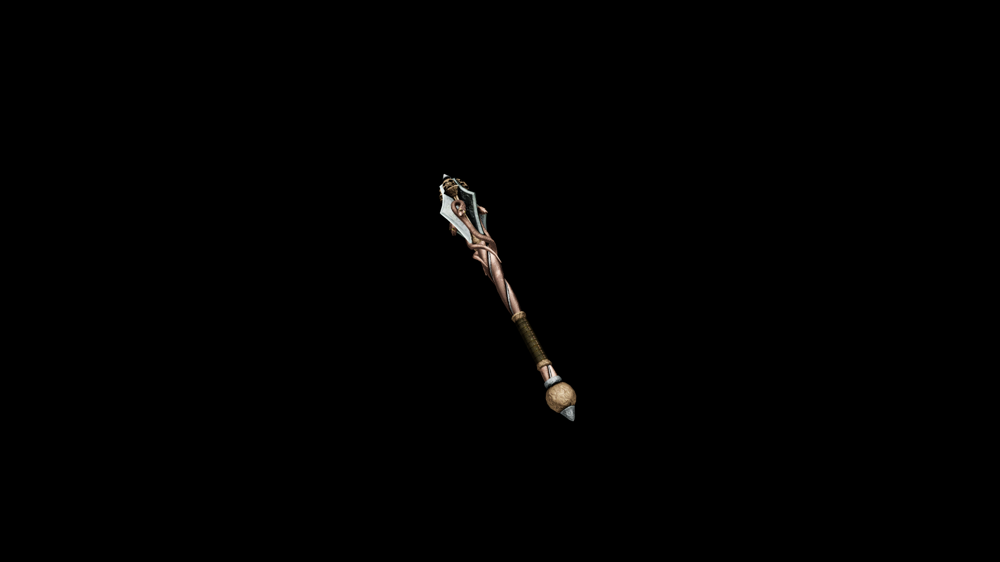

# Necro Mace

Each crushing blow carries a necrotic shock, splintering bone and weakening the spirit of its victims.

 
## Item stats

  
Item stats

  <table>
    <tr><th>Weight</th><td>44.5</td></tr>
    <tr><th>Value</th><td>2412</td></tr>
    <tr><th>Damage</th><td>11</td></tr>
    <tr><th>Skill</th><td><a href="../../../../Skills/Blunt/">Blunt</a></td></tr>
    <tr><th>Damage Type</th><td>Silver</td></tr>
    <tr><th>Holster Slot</th><td>Hip</td></tr>
    <tr><th>Two Handed</th><td>No</td></tr>
    <tr><th>Weapon Set</th><td>Necro</td></tr>
  </table>

