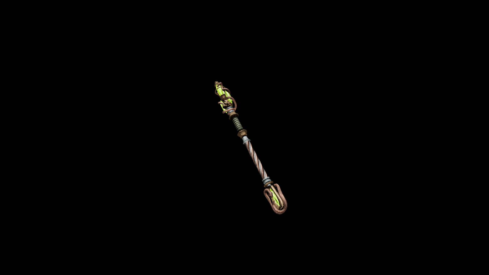

# Necro Staff

It amplifies necromantic spells, allowing the wielder to summon, curse, and drain with terrifying potency.

## Item stats

  
Item stats

  <table>
    <tr><th>Weight</th><td>22.2</td></tr>
    <tr><th>Value</th><td>2084</td></tr>
    <tr><th>Damage</th><td>5</td></tr>
    <tr><th>Skill</th><td><a href="../../../../Skills/Staff/">Staff</a></td></tr>
    <tr><th>Damage Type</th><td>Silver</td></tr>
    <tr><th>Holster Slot</th><td>Back</td></tr>
    <tr><th>Two Handed</th><td>No</td></tr>
    <tr><th>Weapon Set</th><td>Necro</td></tr>
  </table>

