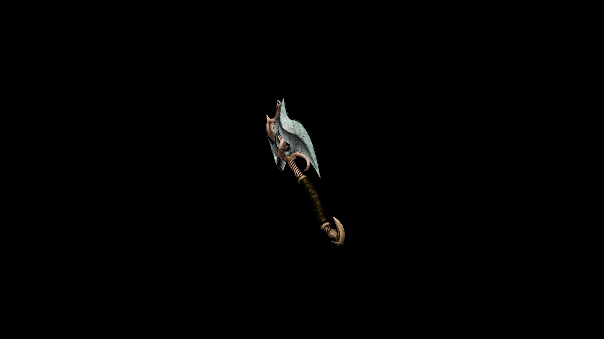

# Necro War Axe

Designed for carnage, it tears through enemies while spreading a rotting curse that weakens and corrupts over time.

## Item stats

  
Item stats

  <table>
    <tr><th>Weight</th><td>36.1</td></tr>
    <tr><th>Value</th><td>1816</td></tr>
    <tr><th>Damage</th><td>10</td></tr>
    <tr><th>Skill</th><td><a href="../../../../Skills/Axe/">Axe</a></td></tr>
    <tr><th>Damage Type</th><td>Silver</td></tr>
    <tr><th>Holster Slot</th><td>Hip</td></tr>
    <tr><th>Two Handed</th><td>No</td></tr>
    <tr><th>Weapon Set</th><td>Necro</td></tr>
  </table>

