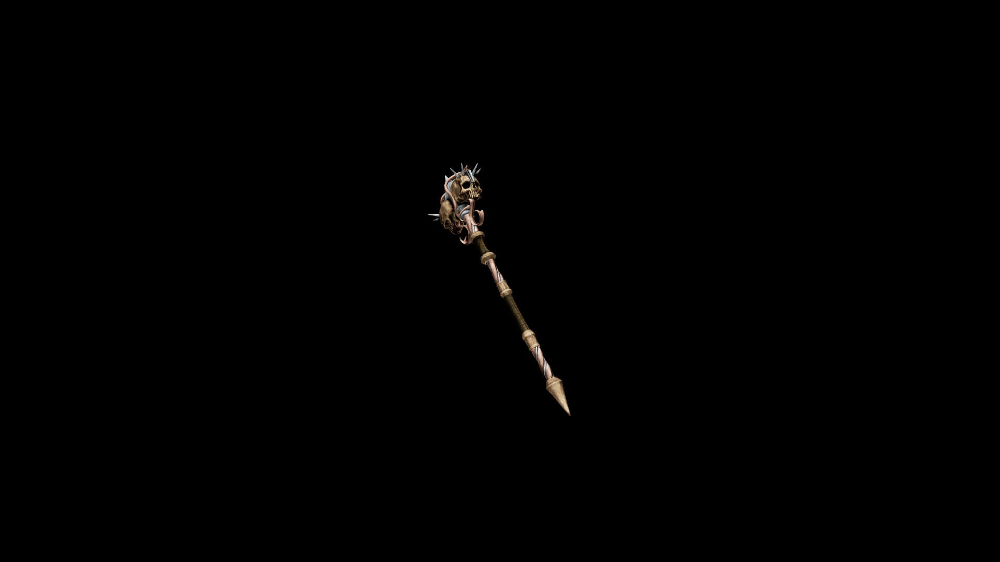

# Necro War Hammer

Each earth-shaking strike unleashes a burst of necrotic energy, splintering armor and draining the life from anything it hits.

## Item stats

  
Item stats

  <table>
    <tr><th>Weight</th><td>77.8</td></tr>
    <tr><th>Value</th><td>3871</td></tr>
    <tr><th>Damage</th><td>13</td></tr>
    <tr><th>Skill</th><td><a href="../../../../Skills/Blunt/">Blunt</a></td></tr>
    <tr><th>Damage Type</th><td>Silver</td></tr>
    <tr><th>Holster Slot</th><td>Back</td></tr>
    <tr><th>Two Handed</th><td>Yes</td></tr>
    <tr><th>Weapon Set</th><td>Necro</td></tr>
  </table>

