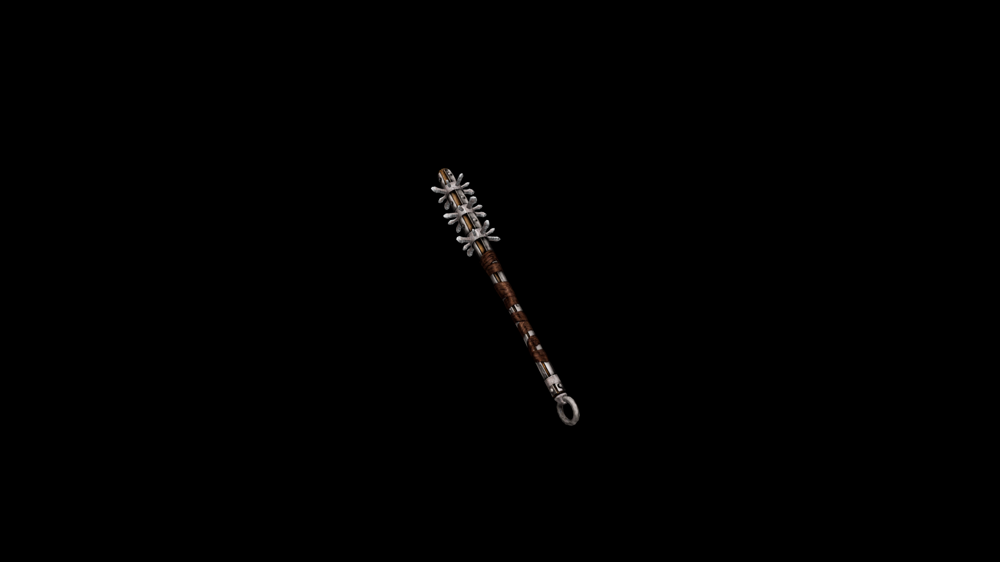

# Orc Club

Its simplicity is its strength—delivering crushing blows that can break bones and shatter shields with brutal force.

## Item stats

  
Item stats

  <table>
    <tr><th>Weight</th><td>18.2</td></tr>
    <tr><th>Value</th><td>640</td></tr>
    <tr><th>Damage</th><td>7</td></tr>
    <tr><th>Skill</th><td><a href="../../../../Skills/Blunt/">Blunt</a></td></tr>
    <tr><th>Damage Type</th><td>Silver</td></tr>
    <tr><th>Holster Slot</th><td>Hip</td></tr>
    <tr><th>Two Handed</th><td>No</td></tr>
    <tr><th>Weapon Set</th><td>Orc</td></tr>
  </table>

