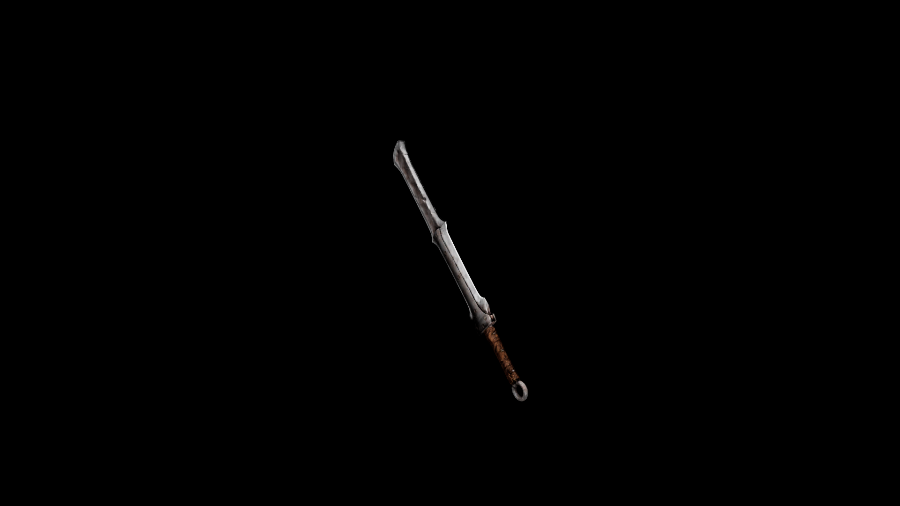

# Orc Long Sword

A heavy, jagged longsword forged from rough steel or iron, with a broad blade made for powerful, cleaving strikes.

## Item stats

  
Item stats

  <table>
    <tr><th>Weight</th><td>36.4</td></tr>
    <tr><th>Value</th><td>1548</td></tr>
    <tr><th>Damage</th><td>12</td></tr>
    <tr><th>Skill</th><td><a href="../../../../Skills/LongBlade/">Long Blade</a></td></tr>
    <tr><th>Damage Type</th><td>Silver</td></tr>
    <tr><th>Holster Slot</th><td>Hip</td></tr>
    <tr><th>Two Handed</th><td>No</td></tr>
    <tr><th>Weapon Set</th><td>Orc</td></tr>
  </table>

