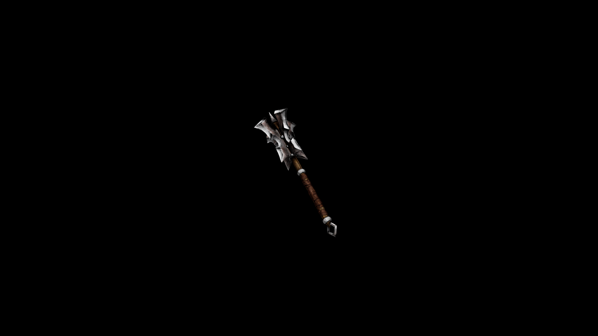

# Orc Mace

With its heavy head and spiked protrusions, it’s a weapon meant to break through armor and shatter bones with relentless force.

## Item stats

  
Item stats

  <table>
    <tr><th>Weight</th><td>29.1</td></tr>
    <tr><th>Value</th><td>1206</td></tr>
    <tr><th>Damage</th><td>9</td></tr>
    <tr><th>Skill</th><td><a href="../../../../Skills/Blunt/">Blunt</a></td></tr>
    <tr><th>Damage Type</th><td>Silver</td></tr>
    <tr><th>Holster Slot</th><td>Hip</td></tr>
    <tr><th>Two Handed</th><td>No</td></tr>
    <tr><th>Weapon Set</th><td>Orc</td></tr>
  </table>

