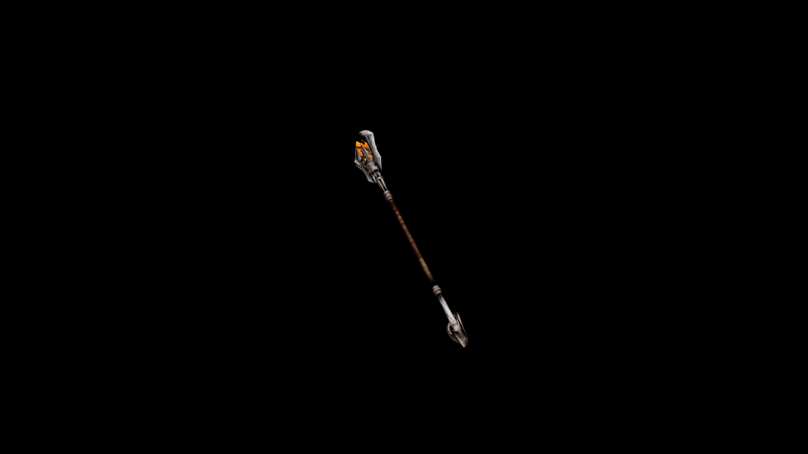

# Orc Staff

Serves as a powerful bludgeoning weapon and a symbol of authority among orc shamans and chiefs.

## Item stats

  
Item stats

  <table>
    <tr><th>Weight</th><td>14.6</td></tr>
    <tr><th>Value</th><td>1042</td></tr>
    <tr><th>Damage</th><td>4</td></tr>
    <tr><th>Skill</th><td><a href="../../../../Skills/Staff/">Staff</a></td></tr>
    <tr><th>Damage Type</th><td>Silver</td></tr>
    <tr><th>Holster Slot</th><td>Back</td></tr>
    <tr><th>Two Handed</th><td>No</td></tr>
    <tr><th>Weapon Set</th><td>Orc</td></tr>
  </table>

