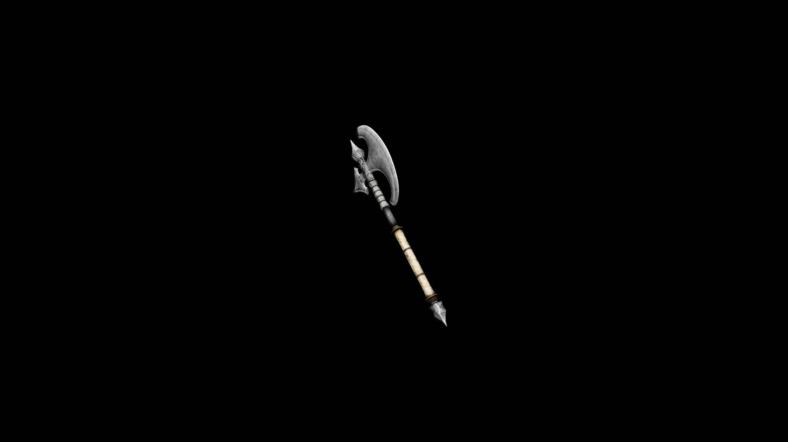

# Silver Battle Axe

Its weight is balanced for both precision and power, and it's particularly effective against creatures vulnerable to silver.

## Item stats

  
Item stats

  <table>
    <tr><th>Weight</th><td>45.5</td></tr>
    <tr><th>Value</th><td>1659</td></tr>
    <tr><th>Damage</th><td>12</td></tr>
    <tr><th>Skill</th><td><a href="../../../../Skills/Axe/">Axe</a></td></tr>
    <tr><th>Damage Type</th><td>Silver</td></tr>
    <tr><th>Holster Slot</th><td>Back</td></tr>
    <tr><th>Two Handed</th><td>Yes</td></tr>
    <tr><th>Weapon Set</th><td>Silver</td></tr>
  </table>

