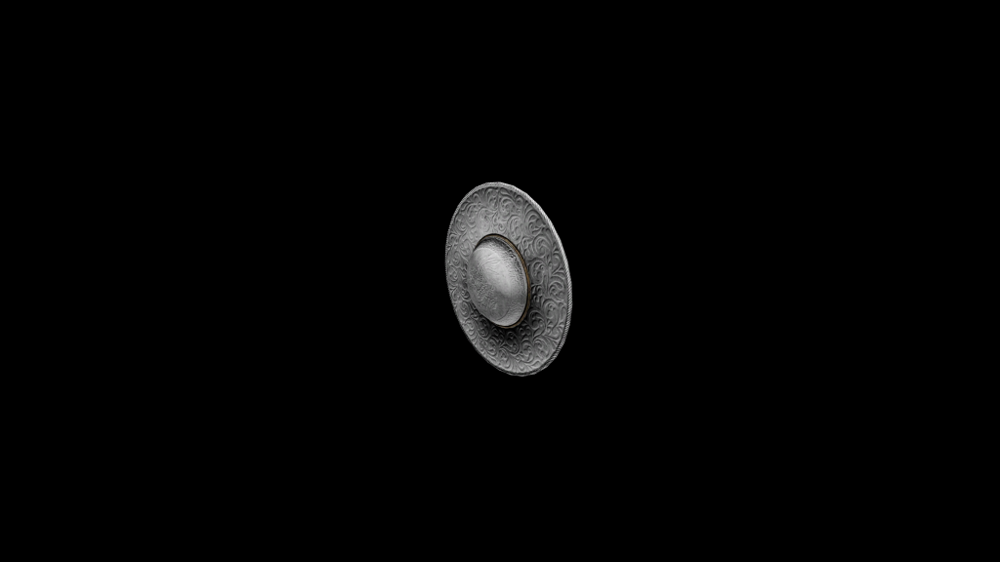

# Silver Buckler Shield

Ideal for parrying and deflecting magic, especially against dark or cursed forces.

## Item stats

  
Item stats

  <table>
    <tr><th>Weight</th><td>8.4</td></tr>
    <tr><th>Value</th><td>319</td></tr>
    <tr><th>Damage</th><td>2.5</td></tr>
    <tr><th>Skill</th><td><a href="../../../../Skills/Block/">Block</a></td></tr>
    <tr><th>Damage Type</th><td>Silver</td></tr>
    <tr><th>Holster Slot</th><td>Hip</td></tr>
    <tr><th>Two Handed</th><td>No</td></tr>
    <tr><th>Weapon Set</th><td>Silver</td></tr>
    <tr><th>Shield Type</th><td><a href="../../../../Gameplay/ShieldTypes/#buckler-shields">Buckler</a></td></tr>
  </table>

