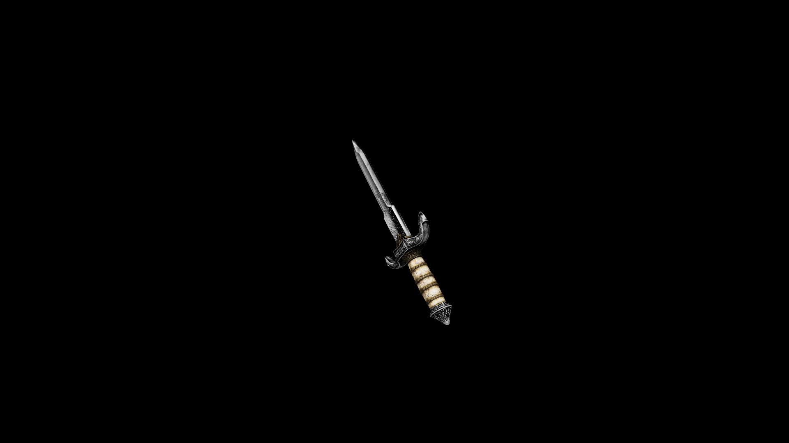

# Silver Dagger

Its sharp edge makes it especially effective against supernatural creatures and enemies vulnerable to silver, offering precision with deadly intent.

## Item stats

  
Item stats

  <table>
    <tr><th>Weight</th><td>5.9</td></tr>
    <tr><th>Value</th><td>178</td></tr>
    <tr><th>Damage</th><td>5</td></tr>
    <tr><th>Skill</th><td><a href="../../../../Skills/ShortBlade/">Short Blade</a></td></tr>
    <tr><th>Damage Type</th><td>Silver</td></tr>
    <tr><th>Holster Slot</th><td>Hip</td></tr>
    <tr><th>Two Handed</th><td>No</td></tr>
    <tr><th>Weapon Set</th><td>Silver</td></tr>
  </table>

