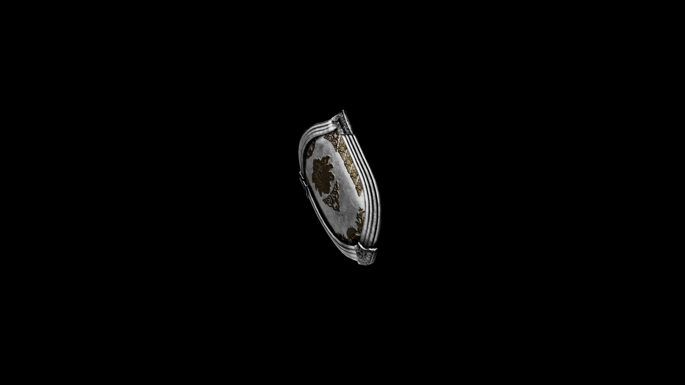

# Silver Shield

Not only does it provide exceptional defense, but its reflective surface can disorient foes, while its silver construction offers added protection against magical and cursed attacks.

## Item stats

  
Item stats

  <table>
    <tr><th>Weight</th><td>23.6</td></tr>
    <tr><th>Value</th><td>510</td></tr>
    <tr><th>Damage</th><td>3.5</td></tr>
    <tr><th>Skill</th><td><a href="../../../../Skills/Block/">Block</a></td></tr>
    <tr><th>Damage Type</th><td>Silver</td></tr>
    <tr><th>Holster Slot</th><td>Hip</td></tr>
    <tr><th>Two Handed</th><td>No</td></tr>
    <tr><th>Weapon Set</th><td>Silver</td></tr>
    <tr><th>Shield Type</th><td><a href="../../../../Gameplay/ShieldTypes/#standard-shields">Standard</a></td></tr>
  </table>

