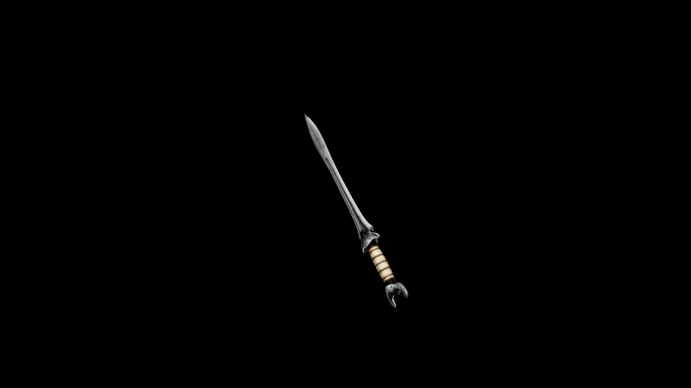

# Silver Short Sword

Lightweight and fast, it’s favored by rogues and duelists, and its silver edge makes it deadly against supernatural threats and creatures vulnerable to silver.

## Item stats

  
Item stats

  <table>
    <tr><th>Weight</th><td>12.6</td></tr>
    <tr><th>Value</th><td>344</td></tr>
    <tr><th>Damage</th><td>7</td></tr>
    <tr><th>Skill</th><td><a href="../../../../Skills/ShortBlade/">Short Blade</a></td></tr>
    <tr><th>Damage Type</th><td>Silver</td></tr>
    <tr><th>Holster Slot</th><td>Hip</td></tr>
    <tr><th>Two Handed</th><td>No</td></tr>
    <tr><th>Weapon Set</th><td>Silver</td></tr>
  </table>

