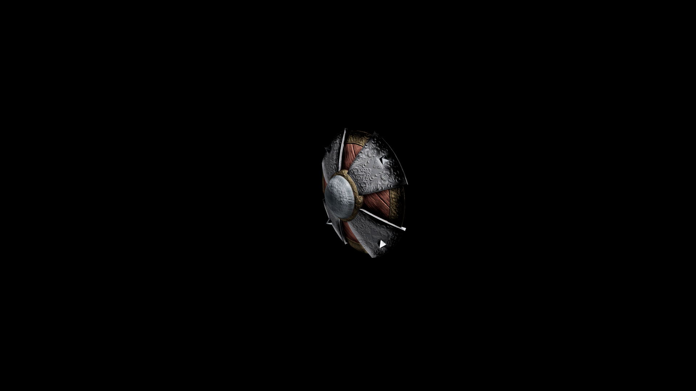

# Steel Buckler Shield

Classic design for steel equipment: metal reinforcements on a wooden base, refined into clean lines and intricate filigree.

## Item stats

  
Item stats

  <table>
    <tr><th>Weight</th><td>7.1</td></tr>
    <tr><th>Value</th><td>212</td></tr>
    <tr><th>Damage</th><td>2</td></tr>
    <tr><th>Skill</th><td><a href="../../../../Skills/Block/">Block</a></td></tr>
    <tr><th>Damage Type</th><td>Physical</td></tr>
    <tr><th>Holster Slot</th><td>Hip</td></tr>
    <tr><th>Two Handed</th><td>No</td></tr>
    <tr><th>Weapon Set</th><td>Steel</td></tr>
    <tr><th>Shield Type</th><td><a href="../../../../Gameplay/ShieldTypes/#buckler-shields">Buckler</a></td></tr>
  </table>

