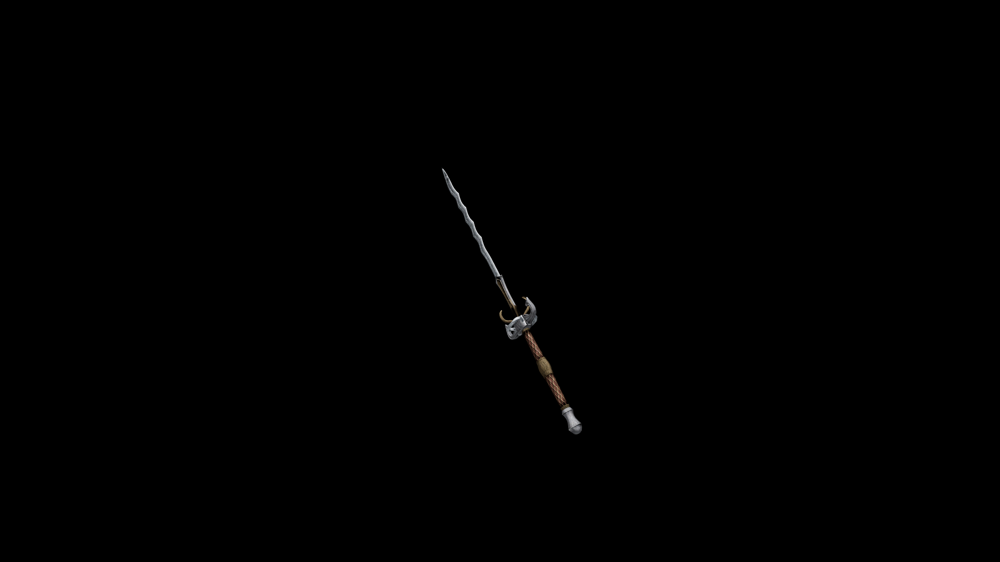

# Steel Great Sword

A sheet of damascus fixed between a thicker piece of steel and a wooden frame. This shield might be more at home on the wall of some great castle than on the arm of a soldier.

## Item stats

  
Item stats

  <table>
    <tr><th>Weight</th><td>33.9</td></tr>
    <tr><th>Value</th><td>1344</td></tr>
    <tr><th>Damage</th><td>14</td></tr>
    <tr><th>Skill</th><td><a href="../../../../Skills/LongBlade/">Long Blade</a></td></tr>
    <tr><th>Damage Type</th><td>Physical</td></tr>
    <tr><th>Holster Slot</th><td>Back</td></tr>
    <tr><th>Two Handed</th><td>Yes</td></tr>
    <tr><th>Weapon Set</th><td>Steel</td></tr>
  </table>

