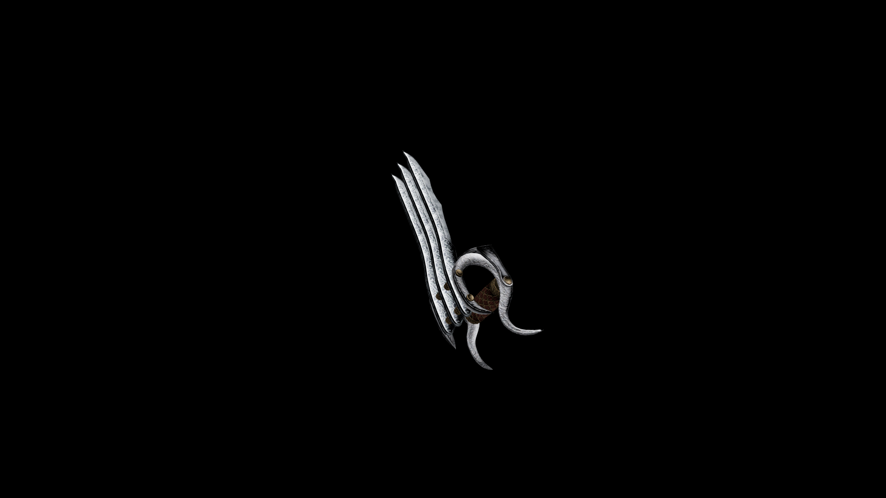

# Steel Knuckles

Long blades have been attached to a fairly simple knuckle, turning a normally mundane weapon into a vicious implement of ferocity.

## Item stats

  
Item stats

  <table>
    <tr><th>Weight</th><td>2.5</td></tr>
    <tr><th>Value</th><td>51</td></tr>
    <tr><th>Damage</th><td>5</td></tr>
    <tr><th>Skill</th><td><a href="../../../../Skills/HandToHand/">Hand To Hand</a></td></tr>
    <tr><th>Damage Type</th><td>Physical</td></tr>
    <tr><th>Holster Slot</th><td>Hip</td></tr>
    <tr><th>Two Handed</th><td>No</td></tr>
    <tr><th>Weapon Set</th><td>Steel</td></tr>
  </table>

